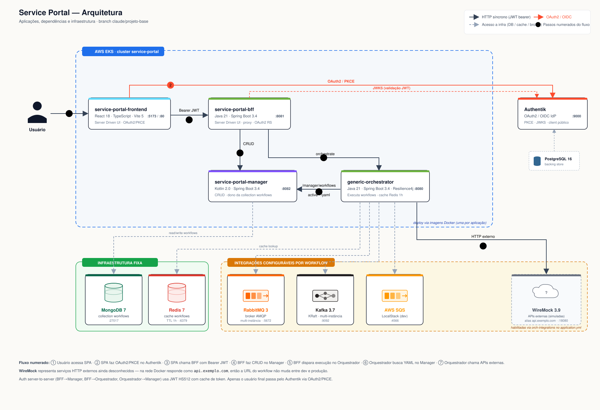

# Projeto: Portal com Arquitetura de Orquestração

## Contexto geral

Portal extensível com arquitetura em **4 camadas**, baseado em **Server Driven UI**. O BFF controla dinamicamente o que o frontend renderiza; o gerenciamento de workflows foi extraído do orquestrador para um novo serviço dedicado, e o orquestrador consome workflows via Redis (cache de 1h) com fallback no Manager.

Diretório raiz: `/home/luizkt/git/service-portal/`

---

## Diagrama geral



---

## Componentes

| Diretório | Stack | Porta | Responsabilidade |
|---|---|---|---|
| [generic-orchestrator/](generic-orchestrator/) | Java 21 + Spring Boot 3.4.5 + Redis | 8080 | **Executa** workflows. Consome YAML do Manager (cache Redis 1h). Sem dependência direta de banco |
| [service-portal-manager/](service-portal-manager/) | Kotlin 2.0 + Spring Boot 3.4.5 + MongoDB | 8082 | **CRUD** de workflows. Único dono da collection `workflows` (após migração) |
| [service-portal-bff/](service-portal-bff/) | Java 21 + Spring Boot 3.4.5 + WebClient | 8081 | Server Driven UI + proxy: CRUD→Manager, execução→Orquestrador |
| [service-portal-frontend/](service-portal-frontend/) | React 18 + Vite 5 + TypeScript | 5173 | UI dinâmica via `UiSchema` do BFF; OAuth2/PKCE via Authentik |

Todos os componentes vivem na branch `claude/projeto-base`.

---

### 1. Frontend

- **Stack:** React 18 + Vite 5 + TypeScript + Vitest
- **Conceito:** Server Driven UI — sem lógica de negócio; renderiza schemas JSON do BFF
- **Componentes:** `Sidebar`, `ComponentRenderer`, `FlowManager`
- **Auth:** OAuth2 Authorization Code + PKCE (S256) direto contra Authentik; tokens em sessionStorage; Bearer enviado ao BFF
- **Cliente HTTP:** [src/api/bff.ts](service-portal-frontend/src/api/bff.ts)

### 2. BFF (Backend for Frontend)

- **Stack:** Java 21 + Spring Boot 3.4.5 + Spring WebFlux/WebClient
- **Responsabilidade:** Server Driven UI + proxy. **CRUD vai para o Manager; execução vai para o Orquestrador.**
- **Endpoints:**

| Método | Path | Função | Backend |
|---|---|---|---|
| GET | `/bff/health` | Healthcheck | — |
| GET | `/bff/auth/config` | Config OAuth2/PKCE para o SPA | — |
| GET | `/bff/menu` | Itens da sidebar | — |
| GET | `/bff/features/{featureId}/ui-schema` | Schema JSON da feature | — |
| GET | `/bff/flows?page=&size=&sort=&status=` | Lista paginada (`status=active` filtra ativos) | **Manager** |
| GET | `/bff/flows/{flowId}/versions/{version}` | Metadados | **Manager** |
| GET | `/bff/flows/{flowId}/versions/{version}/yaml` | YAML cru | **Manager** |
| POST | `/bff/flows` | Cria fluxo | **Manager** |
| PUT | `/bff/flows/{flowId}/versions/{version}` | Atualiza fluxo | **Manager** |
| DELETE | `/bff/flows/{flowId}/versions/{version}` | Soft-delete | **Manager** |
| POST | `/bff/flows/{flowId}/versions/{version}/executions` | Cria execução do fluxo | **Orquestrador** |

- **Auth tripla:**
  - Inbound: OAuth2 Resource Server (Authentik JWKS)
  - Outbound 1: server-to-server contra Manager (`ManagerAuthService` + `ManagerClient`)
  - Outbound 2: server-to-server contra Orquestrador (`OrchestratorAuthService` + `OrchestratorClient`)

### 3. service-portal-manager

- **Stack:** Kotlin 2.0 + Spring Boot 3.4.5 + MongoDB
- **Responsabilidade:** **dono da collection `workflows`.** Recebe YAML, valida estrutura mínima, persiste com `yamlContent` cru. Expõe APIs de CRUD para o BFF e APIs de consulta para o orquestrador.
- **Endpoints principais:**

| Método | Path | Função |
|---|---|---|
| POST | `/manager/flows` | Cria fluxo (body: YAML) |
| GET | `/manager/flows?page=&size=&sort=` | Lista paginada (sem `yamlContent`) |
| GET | `/manager/flows?status=active` | Lista compacta de ativos — **consumida pelo orquestrador** |
| GET | `/manager/flows/{flowId}/versions/{version}` | Metadados |
| PUT | `/manager/flows/{flowId}/versions/{version}` | Atualiza |
| DELETE | `/manager/flows/{flowId}/versions/{version}` | Soft-delete |
| GET | `/manager/flows/{flowId}/versions/{version}/yaml` | YAML cru — **consumido pelo orquestrador** |
| POST | `/api/auth/tokens` | Cria JWT server-to-server (em vez do antigo `/login`) |

- **Schema Mongo** (collection `workflows`):

```js
{ "_id": ObjectId(...),
  "flowId": "create-order-v1",
  "version": "1.0.0",
  "description": "...",
  "active": true,
  "yamlContent": "flow:\n  id: \"create-order-v1\"\n  ...",
  "createdAt": ISODate(...),
  "updatedAt": ISODate(...),
  "_class": "com.serviceportal.manager.domain.FlowDocument" }
```

### 4. Orquestrador

- **Stack:** Java 21 + Spring Boot 3.4.5 + **Redis** + Resilience4j (sem banco de dados)
- **Status:** após o refactor, **executa** workflows. Não gerencia mais — consome YAML do Manager via cache Redis. Não tem mais dependência direta com MongoDB; persistência de domínio (passo `type: DATABASE`) foi **removida**: workflows que precisam gravar dados chamam APIs HTTP downstream.
- **Endpoints públicos:**

| Método | Path | Função |
|---|---|---|
| POST | `/api/auth/tokens` | Cria JWT server-to-server |
| POST | `/api/flows/{flowId}/versions/{version}/executions` | Cria execução do fluxo |
| GET | `/actuator/health` | Healthcheck |

- **Carregamento de fluxo durante a execução:**
  1. `WorkflowCacheService.load(flowId, version)` consulta Redis (`workflows::{flowId}_{version}`)
  2. **Cache hit** → devolve `FlowDefinition` parseado
  3. **Cache miss** → `ManagerWorkflowClient.fetchYaml(...)` → `YamlParserService.parse(...)` → cacheia (TTL 1h) → devolve
- **Warm-up no startup:** `WorkflowCacheWarmer` ouve `ApplicationReadyEvent`, chama `GET /manager/flows?status=active`, e popula o Redis com cada fluxo ativo. Falhas individuais não impedem a subida.
- **Resiliência HTTP** (Resilience4j) nas chamadas externas dos workflows: retry com backoff exponencial + circuit breaker, ordem `Retry(CircuitBreaker(httpCall))`, configuração externalizada em `orch-integrations.retry-configuration` e `.circuit-breaker-configuration`.

---

## Fluxo geral

```
Usuário
  └─> Frontend (React, :5173)
        ├─> [OAuth2 PKCE direto contra Authentik :9000]
        │   └─> recebe access_token, guarda em sessionStorage
        └─> BFF (Java, :8081)  Authorization: Bearer <access_token>
              ├─> GET  /bff/menu                                       → schema da sidebar
              ├─> GET  /bff/features/{featureId}/ui-schema             → schema da feature
              ├─> GET  /bff/auth/config                                → issuer/clientId/scopes
              │
              ├──[CRUD]──► service-portal-manager (Kotlin, :8082)
              │              ├─ POST /api/auth/tokens (server-to-server)
              │              ├─ /manager/flows[...] versions[...]      (CRUD)
              │              └─ MongoDB (collection workflows com yamlContent)
              │
              └──[execução]──► generic-orchestrator (Java, :8080)
                                ├─ POST /api/auth/tokens (server-to-server)
                                ├─ POST /api/flows/{flowId}/versions/{version}/executions
                                │     └─ WorkflowCacheService.load()
                                │           ├─ Redis HIT → FlowDefinition parseado
                                │           └─ Redis MISS → Manager:
                                │                 GET /manager/flows/{id}/versions/{v}/yaml
                                │                 └─ parse + cacheia (TTL 1h)
                                │     └─ executa integrações (HTTP/QUEUE)
                                └─ RabbitMQ, Kafka, SQS, WireMock
                                   (sem dependência direta com MongoDB)
```

---

## Infraestrutura local — `docker-compose-service-portal.yml`

| Serviço | Imagem | Porta |
|---|---|---|
| postgresql | `postgres:16-alpine` | — |
| authentik-server | `ghcr.io/goauthentik/server:2026.2.1` | 9000 / 9443 |
| authentik-worker | `ghcr.io/goauthentik/server:2026.2.1` | — |
| mongodb | `mongo:7` | 27017 (consumido apenas pelo Manager) |
| **redis** | `redis:7-alpine` | 6379 |
| rabbitmq | `rabbitmq:3-management-alpine` | 5672 / 15672 |
| kafka | `bitnami/kafka:3.7` (KRaft) | 9092 |
| wiremock | `wiremock/wiremock:3.9.1` | 18080 (admin/host); alias `api.exemplo.com` |
| **manager** | `service-portal-manager` | 8082 |
| orchestrator | `generic-orchestrator` | 8080 (interno) |
| bff | `service-portal-bff` | 8081 |
| frontend | `service-portal-frontend` (nginx) | 80 |

Ordem de subida garantida via healthchecks:

```
postgresql ─► authentik-server, authentik-worker
mongodb    ─► manager
redis, rabbitmq, kafka, wiremock, manager  ─► orchestrator
authentik-server, orchestrator, manager  ─► bff  ─► frontend
```

---

## Pontos em aberto

| # | Ponto | Detalhe |
|---|-------|---------|
| 1 | **Authentik provider/application** | Cadastrar OAuth2/OIDC Provider + Application com slug `service-portal` e client public `service-portal-spa` (passos descritos no header do `docker-compose-service-portal.yml`) |
| 2 | **REST refactor concluído** | Todos os paths agora são REST-shape (sub-recursos via `/versions/{version}`, filtros via query params, sem verbos no path) e nomes em inglês (paths, payloads e YAML). Frontend `FlowManager` e `bff.ts` já refatorados |
| 3 | **Migração de docs antigos** | Documentos da collection `workflows` criados pelo orquestrador antes do Manager não têm `yamlContent`. O `getYaml` do Manager devolve 404 nesses casos. Se houver fluxos legados, precisa-se criar um job de backfill (não escopado) |
| 4 | **Invalidação de cache cross-service** | Hoje o orquestrador só invalida workflows pelo TTL de 1h. Em produção, considerar Redis Pub/Sub ou um endpoint admin de invalidação no orquestrador chamado pelo Manager nos updates |
| 5 | **Novas features** | Adicionar novos `type`s no `ComponentRenderer` conforme o portal evoluir |

---

## Observações técnicas

- **Server Driven UI** permite ao BFF evoluir o portal sem deploys de frontend para cada nova feature — basta retornar um `UiSchema` com `type` já suportado.
- **Separação Manager × Orquestrador**: dois bounded contexts, dois processos. O Manager publica workflows; o orquestrador executa. A ponte é o YAML cru — fonte de verdade do Manager — entregue por `GET /manager/flows/{flowId}/versions/{version}/yaml`.
- **Cache Redis (1h TTL)**: amortiza chamadas ao Manager por execução. Para 1000 execuções/min de um mesmo workflow, o orquestrador faz no máximo 1 chamada/hora ao Manager (ou 0, se o warm-up já cobriu). Trade-off: workflows atualizados ficam stale por até 1h até o TTL expirar.
- **Auth em camadas**: o frontend nunca vê tokens server-to-server. O BFF mantém dois caches separados (orquestrador e Manager). O orquestrador mantém um cache para o Manager. O usuário final autentica apenas via Authentik OAuth2/PKCE.
- **Resiliência HTTP** no orquestrador (Resilience4j) protege os fluxos de workflow contra serviços externos instáveis — não confunde com a chamada ao Manager (que tem timeout próprio mas sem retry/CB; falha de Manager é raro e o warm-up permite operar mesmo sem ele temporariamente).
